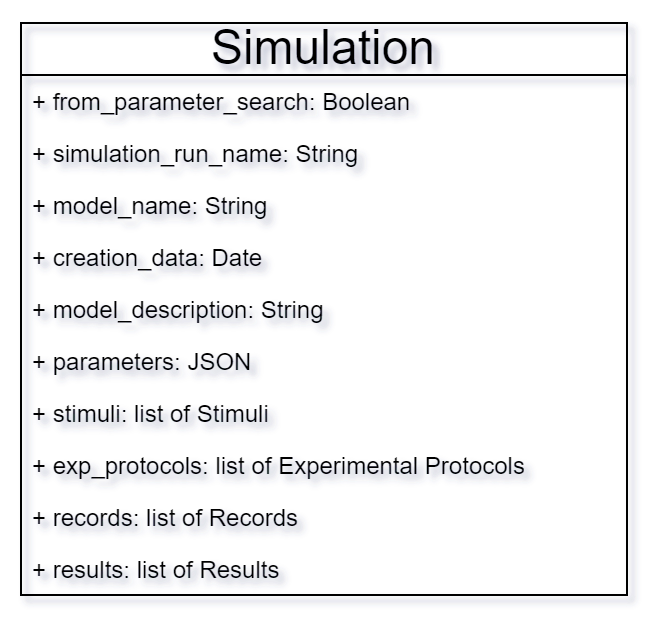
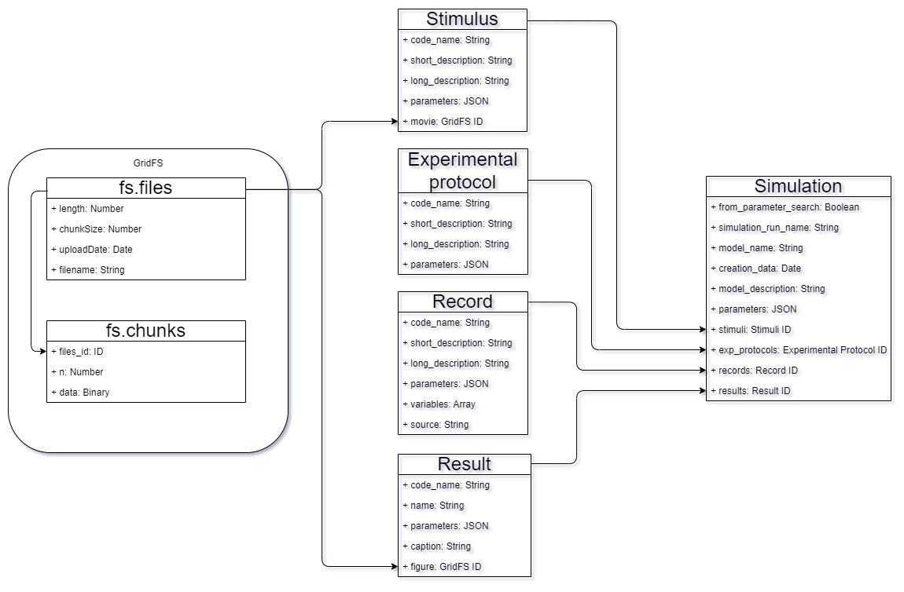
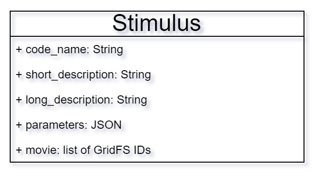
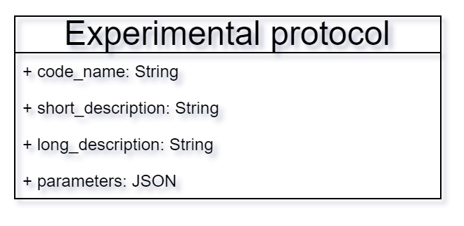
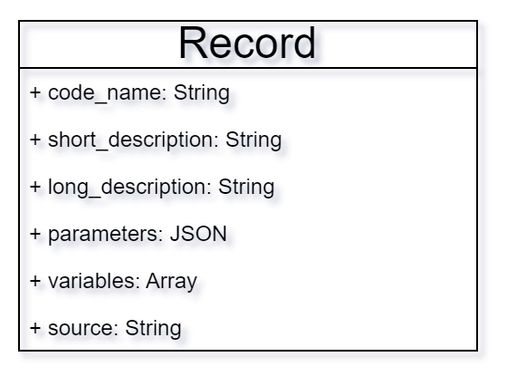
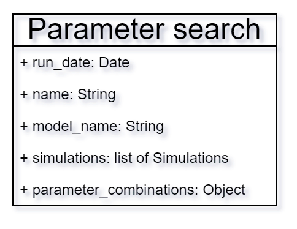
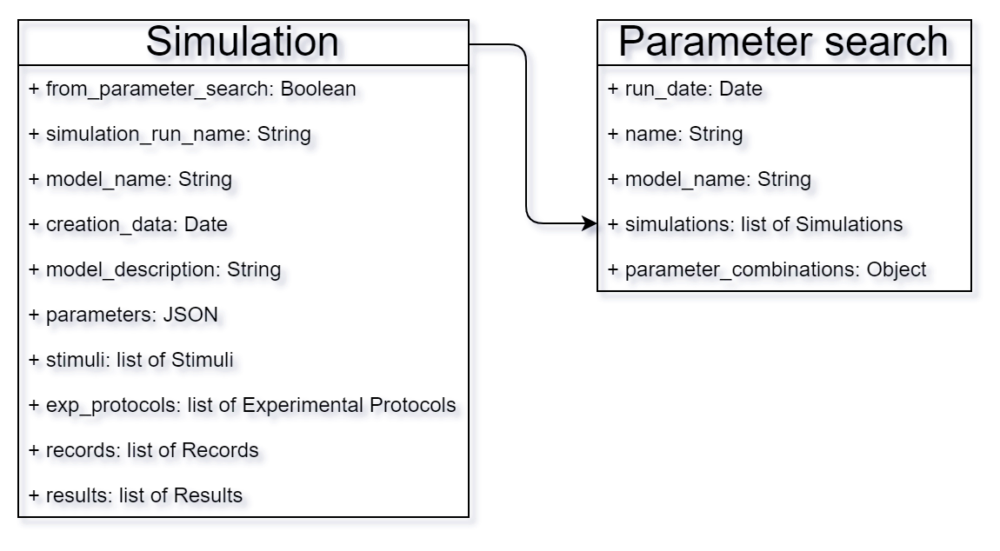

# API

Arkheia API is fully defined by the format in which individual simulation runs (or parameter searches) are stored in the associated MongoDB database. Currently the name of the database Arkheia expects data to be stored is fixed to _Arkheia_. It is the responsibility of the given simulation framework to convert the data into the described format under here into folders.

## Format for individual simulation runs

The data we want to store inside the database aligns perfectly with MongoDB's preferences due to the information about the simulation arriving in a JSON file called sim_info, allowing direct mapping of data from this file into MongoDB documents. The data is then processed in the frontend and based on the models defined in the backend it is saved to the database. The simulation has the following format:

_Figure 1: The simulation_

Now we will discuss the fields present in a simulation:
- **from_parameter_search**: Indicates whether the simulation is part of a parameter search.
- **simulation_run_name**: Stores the name of the simulation.
- **model_name**: Stores the name of the simulated model.
- **creation_date**: Holds information about when the simulation was executed.
- **model_description**: Contains a description of the simulated model.
- **parameters**: Defined as a mixed type in the MongoDB model, allowing the storage of a JSON-type attribute.
- **stimuli, exp_protocols, records**, and **results**: Lists of MongoDB's pre-defined IDs which is a field accessible as _id. These IDs reference associated documents, providing links for accessing related simulation data.

The simulation together looks is described in Figure 2 below:

_Figure 2: The simulation and its components_

# The representation of stimuli

The stimuli contain a list of IDs, which are associated with the stimuli of the simulation. These results contain a movie presented to the neural network model, which the user can freely inspect. 
- **code_name**: Serves as a unique identifier for a specific instance of a stimulus.
- **short_description**: Provides a brief summary of the stimulus.
- **long_description**: Contains a more detailed description of the stimulus.
- **parameters**: A JSON field analogous to the parameters field in the simulation document, but with potentially different keys and values.
- **movie**: Stores a single ID referencing a file within a GridFS document.

_Figure 3: The stimulus_

# The representation of experimental protocols

The exp_protocols structure represents the description of experiments run during the simulation. 
The fields seen here, on Figure 4 are analogous to the previously mentioned fields.

_Figure 4: The experimental protocol_

# The representation of records

The recorders contain the list of IDs associated with the recording apparatus used to capture the neural activity in the simulated model. 
- **code_name**: A unique identifier for the recording.
- **short_description**: A brief summary of the recording.
- **long_description**: A detailed description of the recording.
- **parameters**: A field in a JSON format containing parameters related to the records
- **variables**: An array of strings, which is associated with a variable that was recorded from the neurons of the simulation. 
- **source**: The name of the neurons to which this recorder was applied to.

_Figure 5: The recorders_

# The representation of results

The results are important for streamlined simulation analysis. They often include figures, which are images, with explanatory captions, enhancing data visualization. Mozaik analysis of recorded simulation data produces results containing figures with mainly graphs and other metrics.
- **code_name**: Identifies the source code responsible for generating the result.
- **name**: The designated name for the result.
- **parameters**: The specific set of parameters used to generate the result.
- **caption**: A caption of the accompanying result.
- **figure**: The ID for the GridFS storage to be associated with the figure of the result

# The representation of parameter searches

A parameter search is a series of simulations where we systematically vary a subset of input parameters. This allows the researchers to observe how changing these parameters affects the simulation results, providing insights into the model's behavior based on certain factors. 
Arkheia supports two ways to handle parameter searches. Users can provide a file specifying parameter combinations, allowing for faster processing and the inclusion of searches with intentionally missing parameter combinations. This way Arkheia doesn’t have to search through the simulations to identify the varying subsets of simulation parameters’ values. 

_Figure 6: The parameter search_

Alternatively, Arkheia can directly analyze uploaded simulation parameter files, identifying variations between simulations. This is convenient when a modified parameter file is unavailable, but this comes at a performance cost, because Arkheia will have to iterate through all of the simulations’ parameters.
- **run_date**: The date the parameter search was executed on the simulation framework.
- **name**: The designated name for the parameter search.
- **model_name**: The name of the simulated model.
- **simulations**: A list of simulation IDs associated with the parameter search.
- **parameter_combinations**: An object representing the varying parameters within the parameter search. Keys within this object are parameter names, and their values are lists of the different parameter values tested.

_Figure 6: The parameter search and simulations connection_