# Client documentation

Arkheia offers users a convenient way of organizing, exploring and publishing neural simulation results using a dedicated web application.
In this section of the documentation we will explain to the user the web-based GUI frontend.
To find out how to install and deploy Arkheia please refer to the [Installation & Deployment](/documentation/installation) section of the documentation.

The Arkheia follows the common client-server architecture. To learn how to communicate with the server, and extend Arkheia to be compatible with any other simulation framework, please refer to the [API](/documentation/api) part of the documentation. 

## The Navbar
Upon entering the webpage, the user will see a navbar, on the top side of the page, which is always present, no matter where the user heads.

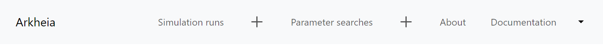
_Figure 1: The Navbar_

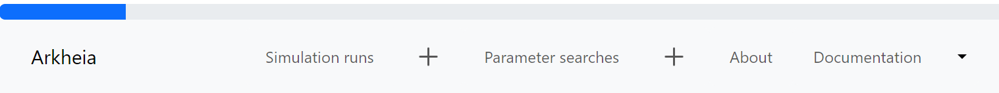
_Figure 2: The Navbar during upload_

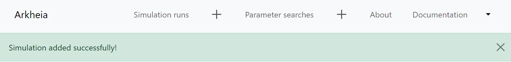
_Figure 3: The Navbar after a succesful upload_

On the left side, the application name serves as a clickable button that redirects the user to Arkheia's welcome page. The navbar includes buttons for Simulation runs, Parameter searches, About, and a Documentation dropdown, providing easy access to these respective sections of Arkheia. The plus icons beside the Simulation runs and Parameter searches buttons enable folder uploads. Clicking the plus icon triggers a directory selection dialog.

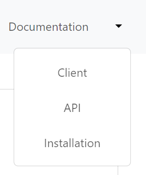
_Figure 4: The dropdown menu for the different documentations_

The documentation section offers guides for installation, using the Arkheia client, and working with the API.
If the user clicks any other button during an upload, a dialog will pop up, which asks the user if they really want to leave the page. If the user clicks on the Leave site? button, the current uploading will stop and the simulation or the parameter search will not be uploaded, and saved to the database.

## Individual simulation runs page

This page is responsible for showing the simulations to the user. This page contains a table, where the rows contain the simulations uploaded. 

The user can see every simulation uploaded in one page. The headers of the table contain a tooltip, which can help the user navigate the page. The following columns are available at this page:
View simulation alone: If the user clicks the eye icon, the corresponding simulation will open in another page, with all of the information about it, the parameters, the stimuli, the experimental protocols, and the results of the simulation. 
Submission date: The date the simulation was submitted to Arkheia
Run date: The time the simulation was run on a simulation framework
Model name: The name of the model that was simulated
View model description: The user can view the description of a model. The press of this button will trigger a modal to show up. 
View parameters: The parameters of a specific simulation
View stimuli: The stimuli of the simulation
View experimental protocols: The experimental protocols of the simulation
View results: The results of the simulation
Delete simulation run: Deletes one simulation run. This delete operation is handled in a way that not only the simulation is deleted from the database, but every document connected with the simulation. So, in this case it means, that the stimuli, experimental protocols, results, and the records will be deleted from the database too. This leads to a better performance over time and memory reusability. 
The user can also change the name of the simulation with a right click. From the label a textbox will form, containing the current name of the simulation. This textbox can be freely changed, and the changes will save automatically, after the user clicks away.
If the user deletes a simulation from this table, an alert will show up in that row of the table where the simulation was previously located. After the deletion is complete, the window will refresh. There is also a search bar for the model and run names, using which the user can filter out the simulations.

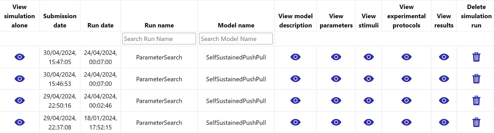
_Figure 5: The simulation runs page_

## The parameters page

This page is responsible for rendering the parameters of the simulation.
The user can expand certain parts of the JSON using the right arrow keys. These keys also show the user how many values are inside it. The user can not only use the keys, but the names themselves to expand that part of the JSON. The used component is highly customisable, which should allow us to change the style of it in the future based on the user demand. 

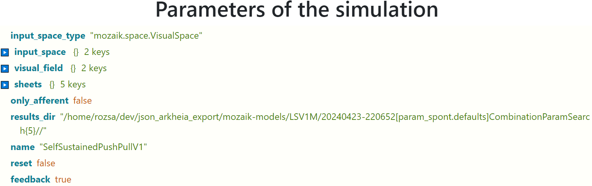
_Figure 6: Parameter view page._

## The stimulus view page

This page will show the user the stimuli of the simulation. Not every simulation will have stimuli, especially if the simulation inside the simulation framework was interrupted. 
The stimuli page is once again, a table containing all the stimuli associated with the simulation uploaded. The Source code name is the identifier that generates the given instance of the stimulus. The Short description is the brief description of the stimulus in that row, similarly, the Long description is the longer, more precise description of the stimulus. Clicking on the eye icon under the Parameters column will result in the web page showing the user a modal, which has the stimulus’s parameters inside of it. This page also contains the parameters shown using the react-json-tree library. On the far-right side, there are the movies the simulations were generated with. We should note that these GIFs have a certain speed of playback, which isn't necessarily the same speed at which they were used during simulation.

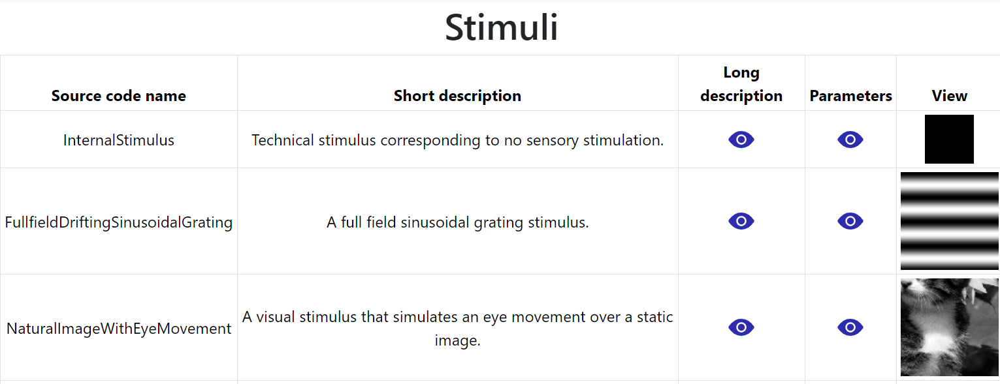
_Figure 7: Stimulus view page._

## Experimental protocols page

This page shows the user the experimental protocols and the records of the simulation. These protocols which are shown here were performed over the model during the simulation run.
The experimental protocols part of the page is very similar to the stimuli view page. It contains the Source code name, Short description, Long description, and Parameters parts, these correspond to the same functionality as on the stimuli page. The records part is very similar to the experimental protocols, the only differences are the Target population and the Recorded variables parts. The Target population is the identifier of the neural population where the recordings were performed. The Recorded variables are the variables that were recorded inside the selected neurons.

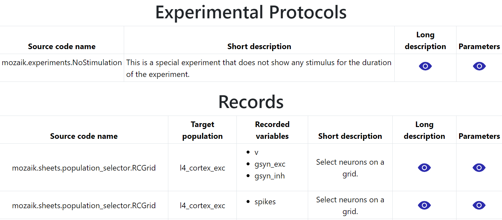
_Figure 8: Experimental protocols page._

## Results page
The main attraction of the results page is the generated figures of the simulation. The user can use these figures to more deeply analyze the simulation results. 
The user is presented with the already well-known table structure. The table's rows are the results from the simulation.  The Source name is the identifier of the source code that generated the given figure. The Name column represents the name given to the figure and the Parameters are, similarly to the stimuli page and the experimental protocol page, the parameters of the source code that generated the given figure. The Caption is the caption given to the figure. The last row is the header Figure which is the figure generated from the simulation. The figures in the last column can be clicked. This triggers a modal to open up, and inside the modal, the user will see the figure in full width, meaning the figure will be the size of almost the whole window.

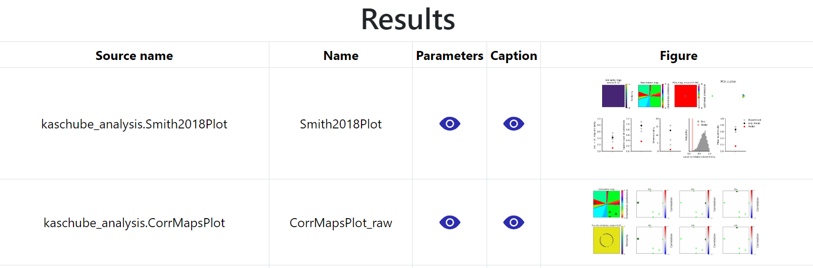
_Figure 9: Results page._

## Parameter search page

Here the user will be presented, similarly to the simulations page, with a table, containing all the parameter searches the user uploaded.
Upon entering this page, the user can see that the layout is similar to the simulation runs page. The table has multiple columns, which we already discussed, like the Submission date, Run date, Name, and Model name. The View individual runs icon will send the user to the simulation runs page, there the table with the simulations will fill with the simulations present in the parameter search. The ID of the parameter search will be appended to the URL of the simulations page, thus informing the frontend of the simulations page to render not the simulations without parameter searches, but the simulations connected to the parameters search, to whom the ID belongs. Here the users can filter the parameter searches based on the name of the parameter search, or by the name of the model. The user can inspect the results of the parameter search using the Inspect results column. 	

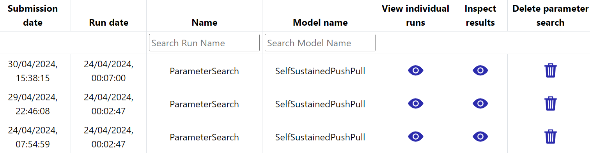
_Figure 10: Parameter search page._

## Parameter search inspect page

This page is responsible for showing the users the different figures based on the selected parameters of the simulations. The user can filter out the different values based on their preferences, thus enabling for an easier comparison between figures. 
Upon entering this page, the user will be presented with, depending on the size of the parameter search, a loading page, which is visible even for the largest of parameter searches only for a split second, or with the page on Figure 11, immediately. This page consists of an Input component, where the user can select the figure they want to see in the table on the underside of this page. The Image Scale slider is for changing the sizes of the figures in the table. Then the parameters follow. The left side of the collection of buttons are the keys of the parameter combinations, whose structure we already discussed earlier. The button is blue if that key is selected to be on the y-axis of the table. There can always be only one key selected. The values are green and are immediately next to the key. These values represent the x-axis of the table. The user can activate and deactivate certain values, but there must always be one value selected for a parameter. Enforcing this, the frontend automatically checks if there is only one button activated in a row, and will lock it, so the user won’t be able to press it until another button is activated in the same row.

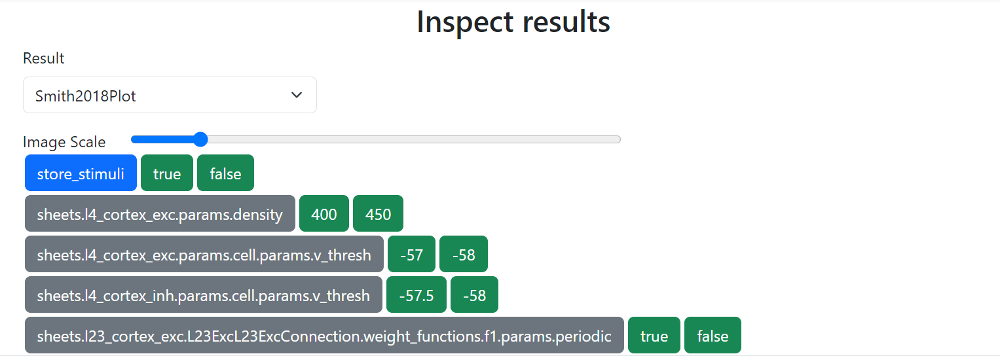
_Figure 11: The upper part of the insect results page_

On the underside of the page, the user will see a table representing a grid. The grid is filled with the figures selected by the user, based on the corresponding x and y-axis parameters and their values. The table fills in the data iterating through all of the parameters and their values and checking it against all the simulations. By the definition of the parameter searches, for every combination, only one simulation exists. After the simulation is found based on the selected figure, the table is generated. If no simulation exists for a combination, nothing will be shown. The header has a fixed position and will be always shown, similarly, the first column defining the y-axis will be always shown, even when scrolling away from it to the right side. The figures are clickable, if the user clicks them, a modal with an enlarged figure will pop up. If the user changes the selected key or the selected values, the table will automatically change, without a need for a refresh. 

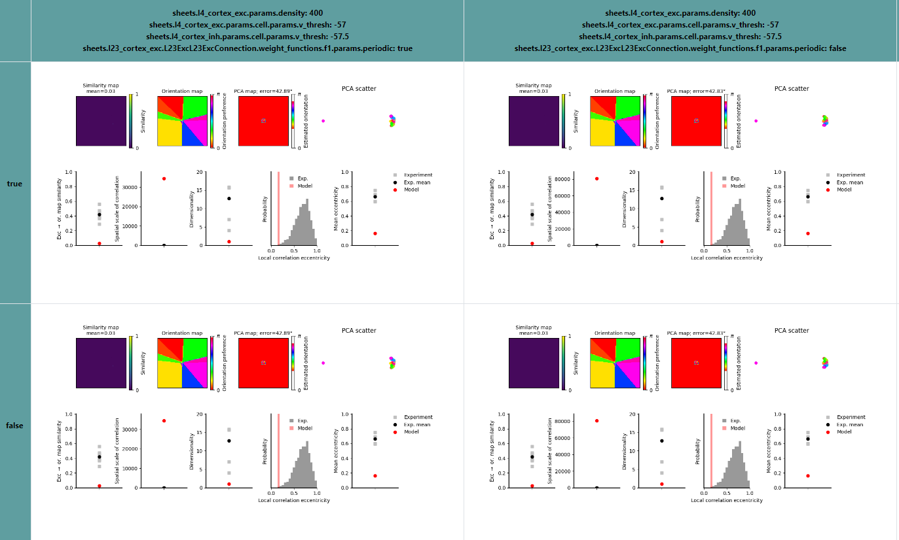
_Figure 12 The underside of the inspect results page_

